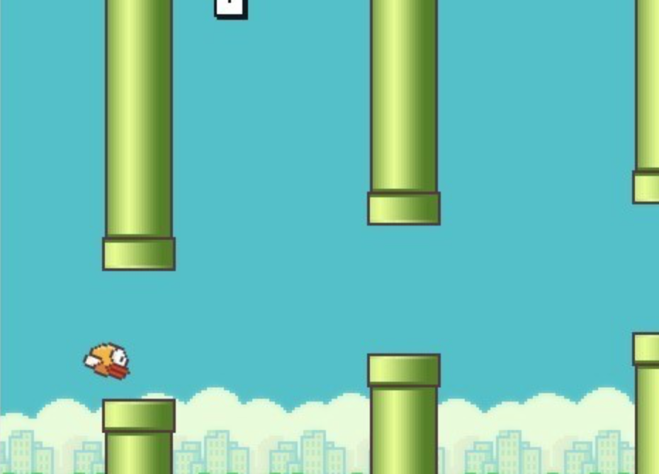

# Flappy bird

## Release1: Create a Flappy Bird Game

- Create flappy bird clone. Use Z-Index(box bindings) to set layers. Use CSS-Animations to animate bird.
- Whenever you hit space bar it should have an upward force(thrust) and move against the gravity. The bird should change it's sprite from Normal to Flying one. 

- There are 3 states of bird: Dead State, Fly State, Idle State. Cut the sprites from original sprite in Flappy Bird directory provided to you

- Whenever you leave the space bar. The bird should come to Idle Sprite and start falling down i.e., thrust 0
- The background of this game should be scrolling. 
- Also use a design pattern called Object Polling to show obstacles repeatingly. Don't re-generate obstacles dynamically. Use a pool of 20 obstacles so that when obstacles are no longer visible in viewport. They should pool back to front & appear as new obstacles(for memory optimisation)

- Given the ground tile is also available whenever the bird hits the tile it dies and game over and show flappy bird death sprite.

All the sprites are in Flappy-Bird folder
